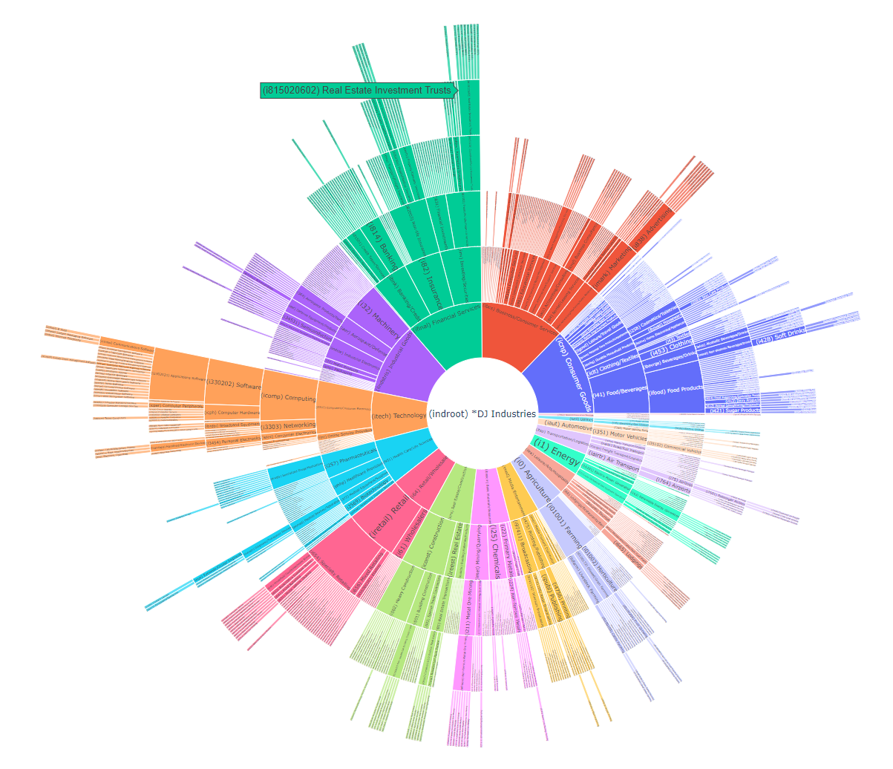
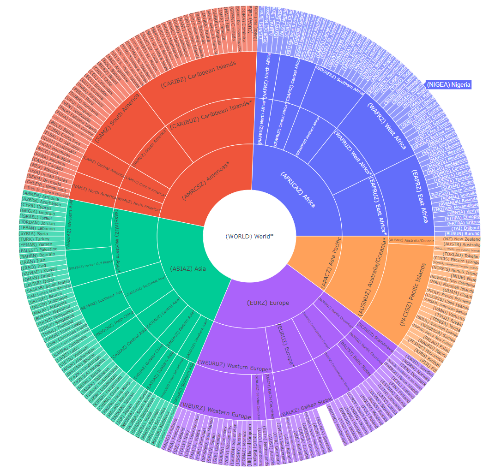

Dow Jones DNA Taxonomy Visualisation
#####################################

djdna_common (Symbolic Link)
============================

Set of common methods that eases operations like reading DNA Snapshots AVRO files, calculating new features or interacting with Elasticsearch. These methods are for illustration purposes and don't have a robust coding to validate unexpected cases or handling exceptions. For this reason it is not distributed as a Python package. It is however used among multiple Dow Jones DNA examples.

To use these methods, clone this and the djdna_common repository to the same base directory, and (if necessary) create a symbolic link or copy the folder content. A sample sequence looks like this:

.. code-block::

    $ git clone https://github.com/miballe/djdna-taxonomy.git
    $ git clone https://github.com/miballe/djdna_common
    $ cd djdna-other-project
    $ ln -s ../djdna_common/ djdna_common

industries.ipynb
================
Notebook with a Dow Jones DNA industries hierarchy visualisation. `High-res version `_.

regions.ipynb
================
Notebook with a Dow Jones DNA regions hierarchy visualisation. `High-res version `_.

